# 23 Best Email Marketing Platforms in 2025

Building an engaged email list and sending newsletters that people actually open determines whether your creator business thrives or struggles in obscurity, whether you're launching an online course, selling digital products, or nurturing a community around your content. The platform you choose affects everything from automation capabilities and list growth tools to deliverability rates and whether you can actually make money from your audience without duct-taping together five different services.

This collection evaluates 23 leading email marketing platforms based on creator-specific needs including automation workflows, landing page builders, commerce integrations, subscriber management, pricing structures, and interface simplicity for non-technical users building personal brands. Each service addresses different requirements, from newsletter-first publishing tools to sophisticated marketing automation systems with CRM functionality and behavioral triggers.

***

## **[Kit](https://convertkit.com)**

The email marketing platform built specifically for creators, serving 587 million subscribers with creator-first features including visual automation, integrated commerce, and recommendations network for audience growth.

Founded by Nathan Barry after discovering how impossibly complicated email marketing felt for solo creators, Kit removes the technical barriers that prevent authors, YouTubers, podcasters, and course creators from leveraging email effectively. The mission-driven, bootstrapped company focuses exclusively on solving real creator problems rather than chasing investor returns.

**Visual automation builder transforms complex workflows** into drag-and-drop sequences that welcome new subscribers, nurture leads based on behavior, and trigger emails when someone purchases a product or clicks specific links. The conditional "if/then" rules work like programming logic without requiring code knowledge.

Free plan generosity stands out with support for 10,000 subscribers including unlimited emails, landing pages, forms, one automation sequence, and the ability to sell digital products with integrated Stripe payments. This makes Kit genuinely usable for growing creators rather than forcing immediate upgrades.

Commerce integration eliminates the need for separate tools by allowing creators to sell ebooks, courses, and recurring subscriptions directly through Kit. The 3.5% transaction fee plus Stripe's standard charges apply, but the simplified workflow removes complexity.

Tag-based subscriber management enables sophisticated segmentation where you categorize people by interests, behavior, and purchase history rather than maintaining separate lists. Clicking specific links automatically applies tags, letting subscribers self-segment based on what content they find interesting.

Landing page and form creators come built-in with customizable templates for lead magnets, product sales, and email capture. While the templates feel slightly dated compared to modern design tools, they convert effectively and require no separate landing page service.

Recommendations network connects Kit users to promote each other's newsletters through paid placements, earning money when you recommend others and gaining subscribers when they recommend you. This creator-to-creator growth channel works particularly well in specific niches.

Sponsor network facilitates connecting with advertisers who want to sponsor your newsletter, creating another monetization stream beyond products and subscriptions. The platform handles advertiser relationships and payment logistics.

Mobile applications for iOS and Android enable sending newsletters and managing subscribers from anywhere, useful for creators without desktop access. The full-featured apps maintain most platform capabilities.

Creator Plan starts at $33 monthly for 1,000 subscribers with unlimited automations, chat support, and integration access. Creator Pro at $66 monthly adds A/B testing, advanced analytics, referral systems, and engagement scoring.

Migration assistance from Kit's team handles transferring subscribers, automations, and templates from other platforms for lists over 5,000. This white-glove service reduces switching friction.

Text-focused email editor prioritizes writing over visual design, which some users appreciate for newsletter clarity but others find limiting compared to block-based builders. The minimalist approach keeps focus on content rather than fancy layouts.

***

## **[Mailchimp](https://mailchimp.com)**

Established email marketing giant with comprehensive features including AI-powered recommendations, extensive integrations, and tools spanning email, landing pages, social media, and basic CRM functionality.

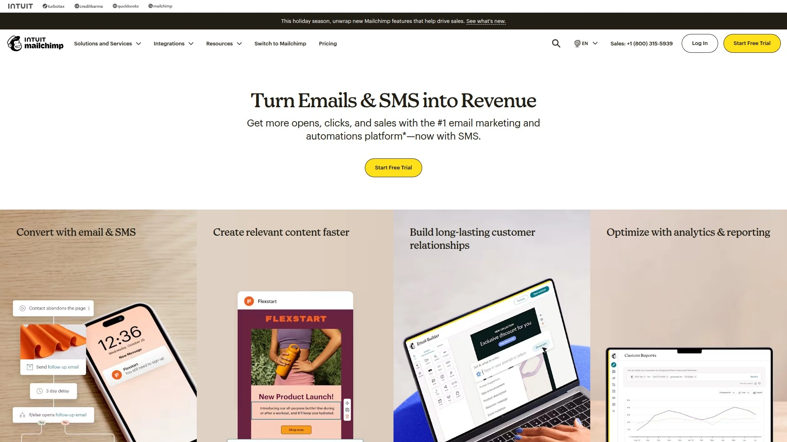

Mailchimp has evolved from pure email service into an all-in-one marketing platform targeting small businesses across industries. The platform's massive user base and brand recognition make it the default starting point many businesses consider.

Free forever plan accommodates 500 contacts and 1,000 monthly email sends with one audience, making it accessible for absolute beginners testing email marketing. The generous allowance includes basic features though automation requires paid upgrades.

Template library exceeds 300 responsive designs across various industries and campaign types. While quantity surpasses some competitors, users note that many templates feel somewhat dated.

Drag-and-drop email builder provides intuitive campaign creation with content blocks for text, images, buttons, and social links. The guided interface works particularly well for newcomers unfamiliar with email marketing concepts.

Marketing automation becomes available on paid plans with Journey Builder enabling multi-step customer journeys triggered by behavior, purchases, and engagement. The visual workflow builder creates conditional paths based on subscriber actions.

AI features suggest send time optimization, subject line recommendations, and content improvements based on campaign performance data. These intelligent suggestions help users improve results without deep marketing expertise.

Segmentation capabilities enable targeting specific audience groups based on demographics, behavior, and engagement levels. Dynamic segments automatically update as subscriber attributes change.

Integration ecosystem connects 300+ third-party applications including ecommerce platforms, CRM systems, and productivity tools. This extensive compatibility makes Mailchimp work within existing business software stacks.

Social media tools allow scheduling posts, creating ads, and tracking engagement from within Mailchimp. This consolidation reduces the number of platforms businesses need to manage.

Landing page builder helps capture leads and promote offers through standalone pages without requiring a website. The pages integrate directly with email list signup forms.

Basic CRM functionality tracks customer interactions and purchase history, though serious businesses eventually need dedicated CRM software. The light CRM features suit small operations just starting out.

Pricing starts at $13 monthly for 500 contacts on the Essentials plan with email support and basic templates. Standard plan at $20 monthly adds automation, A/B testing, and behavioral targeting.

Deliverability concerns appear in user feedback more frequently than with specialized email platforms, with reports of messages landing in spam folders. The shared sending infrastructure affects sender reputation.

Complexity increases as Mailchimp adds features, creating a steeper learning curve than simpler alternatives. The comprehensive feature set can overwhelm users who just want basic email sending.

***

## **[ActiveCampaign](https://activecampaign.com)**

Advanced marketing automation platform combining email, CRM, and customer experience tools with powerful segmentation, conditional logic, and machine learning for sophisticated campaign management.

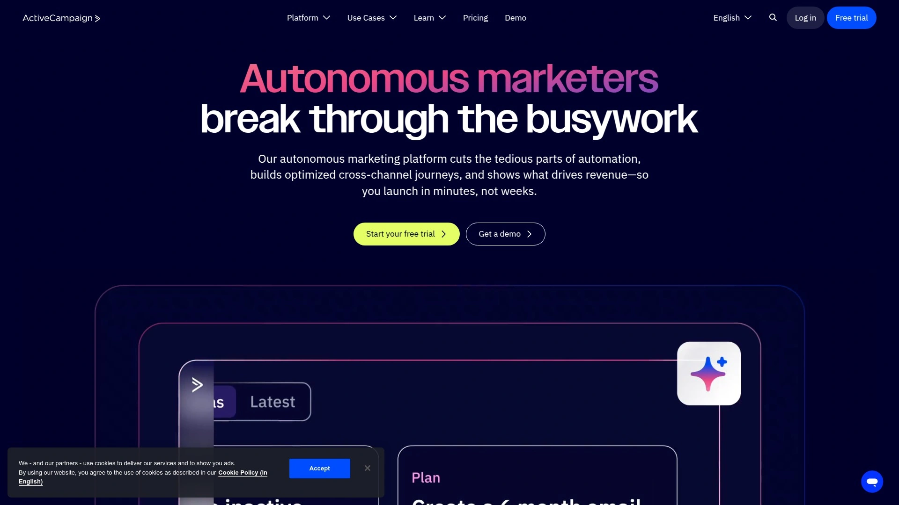

ActiveCampaign targets serious marketers and businesses needing enterprise-grade automation accessible through user-friendly interfaces. The platform's depth makes it suitable for companies growing beyond basic email needs.

Automation capabilities exceed most competitors with visual workflow builders creating complex customer journeys based on behavior, purchases, site activity, and engagement. The conditional branching and goal tracking enable sophisticated nurture sequences.

CRM functionality integrates directly into the platform for tracking deals, managing sales pipelines, and scoring leads based on engagement. This eliminates the need for separate CRM software for many businesses.

Segmentation features use multiple conditions to create precise audience groups based on any combination of attributes, behavior, and engagement. The advanced filtering surpasses simpler platforms significantly.

Machine learning predicts optimal send times, suggests content improvements, and identifies subscribers most likely to engage or purchase. These AI features improve campaign performance automatically.

Email editor balances ease of use with customization flexibility through drag-and-drop design and conditional content blocks. Custom blocks can be saved for reusing in future campaigns.

Site tracking monitors visitor behavior on your website, triggering automations based on pages viewed, products browsed, and time spent. This behavioral data powers personalized follow-up sequences.

Event tracking captures custom actions like webinar attendance, app usage, or content downloads to trigger relevant automations. The flexible event system adapts to any business model.

Reporting depth provides detailed analytics on campaign performance, automation effectiveness, and customer journey progression. The comprehensive reports help optimize marketing strategies.

Third-party integrations exceed 900 connections including ecommerce platforms, payment processors, and business tools. The extensive integration library ensures compatibility with existing software.

Free migration service handles transferring contacts, automations, and templates from other platforms. The dedicated migration team reduces switching complexity.

Learning curve steepness reflects the platform's power, requiring time investment to master advanced features. New users face more complexity than simpler alternatives.

Pricing begins at $19 monthly for 1,000 contacts on the Starter plan with basic automation and email. Professional plans required for CRM, landing pages, and advanced features start higher.

***

## **[Klaviyo](https://klaviyo.com)**

Ecommerce-focused email and SMS platform with deep store integrations, predictive analytics, and revenue attribution designed specifically for online retailers maximizing customer lifetime value.

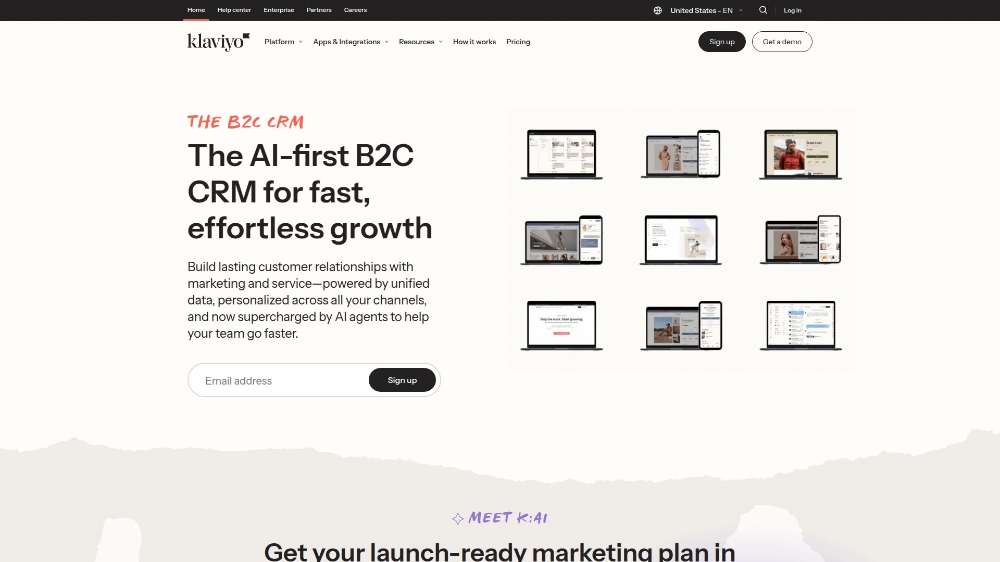

Klaviyo specializes exclusively in ecommerce marketing, making it the go-to choice for Shopify, WooCommerce, and Magento stores. The platform's design assumes product catalogs, purchase data, and transactional triggers.

Product recommendation blocks embed dynamic, personalized product suggestions in emails based on browsing history, past purchases, and customer preferences. These AI-powered recommendations increase relevance and conversion rates.

Revenue reporting attributes dollar amounts directly to specific campaigns and automations, showing exact ROI rather than just open and click rates. This financial tracking helps ecommerce businesses justify marketing spend.

Shopify integration depth exceeds other platforms with real-time sync of products, inventory, purchases, and customer data. The seamless connection makes Klaviyo feel like a native Shopify extension.

Segmentation sophistication uses purchase behavior, product browsing, price points, and predicted customer lifetime value to create hyper-targeted audiences. The ecommerce-specific filters understand shopping behavior patterns.

Pre-built automation flows for abandoned carts, browse abandonment, post-purchase sequences, and win-back campaigns deploy in minutes. These ecommerce-optimized templates convert effectively out of the box.

SMS marketing integrates with email for coordinated multi-channel campaigns, particularly effective for time-sensitive promotions and shipping updates. The combined channel approach improves engagement.

Form builder creates popups, flyouts, and embedded signup forms with targeting rules based on exit intent, time on page, and shopping behavior. The lead capture tools focus on ecommerce conversion optimization.

Benchmark data compares your performance against industry peers for metrics like open rates, click rates, and revenue per recipient. This competitive context helps set realistic performance goals.

Free plan provides 500 monthly email sends with full feature access including automation, making Klaviyo testable before committing. The contact-based pricing structure starts charging as lists grow.

Email editor simplicity prioritizes ease of use with drag-and-drop design and product blocks. The straightforward interface prevents overwhelming ecommerce merchants.

Limited appeal outside ecommerce means service businesses, creators, and B2B companies find better fits elsewhere. The product-centric design assumes inventory and transactions.

Pricing becomes expensive as contact lists grow, with costs escalating faster than some alternatives. The value proposition works best for high-revenue stores with strong email ROI.

***

## **[AWeber](https://aweber.com)**

Long-established email marketing service emphasizing reliability, deliverability, and straightforward campaign sending with tag-based management and extensive template library.

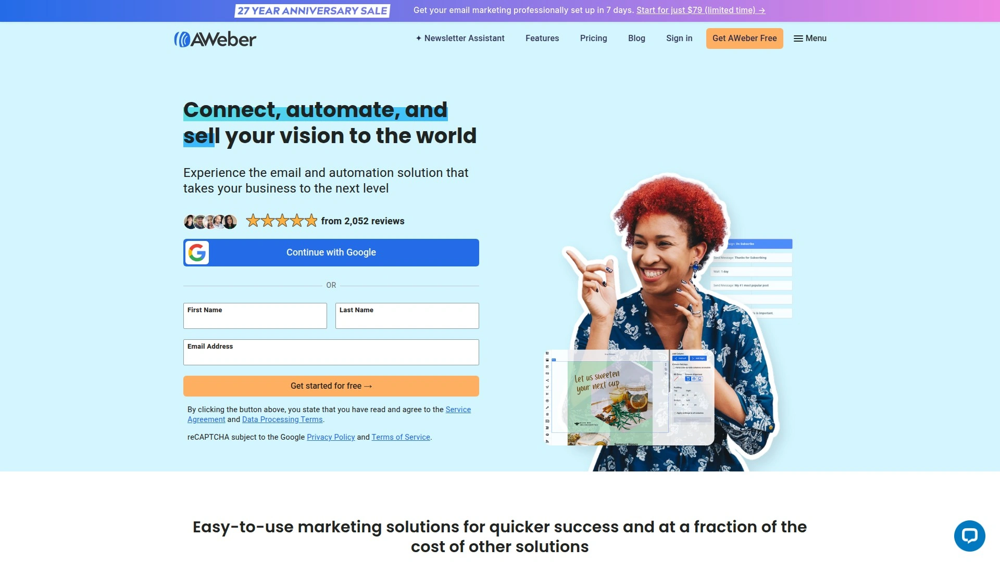

AWeber has operated since 1998, building reputation on consistent service and strong deliverability. The platform appeals to users prioritizing reliable basics over cutting-edge features.

Template selection exceeds 700 responsive designs covering various industries and campaign types. The extensive library provides options for most business needs.

Drag-and-drop editor offers functional design tools with Canva integration and Smart Designer that creates templates matching your website. The AMP email support enables interactive elements like surveys and carousels directly in messages.

Tag-based subscriber management organizes contacts through applied tags rather than maintaining separate lists. This flexible approach simplifies segmentation as businesses grow.

Automation remains more basic than competitors with simple time-based triggers and linear sequences. The platform works well for straightforward welcome series but lacks advanced behavioral workflows.

A/B testing capabilities enable testing subject lines, content, and send times to optimize campaign performance. The split testing features help improve results systematically.

Landing page creator builds standalone pages for lead capture and promotions. The pages integrate with email signups seamlessly.

Free plan supports 500 subscribers with basic features for 30 days. After the trial, paid plans begin at $15 monthly.

Deliverability rates rank better than mass-market competitors like Mailchimp with fewer spam folder issues. The established sender reputation helps messages reach inboxes.

Customer service receives positive marks for responsiveness and helpfulness. The support quality exceeds many competing platforms.

Integration options connect 750+ third-party applications including ecommerce, CRM, and marketing tools. The comprehensive integration library ensures compatibility.

Interface design feels somewhat dated compared to modern alternatives, though functionality remains solid. The older aesthetic doesn't impact core performance.

Limited advanced automation means businesses needing sophisticated workflows eventually outgrow AWeber. The platform excels at straightforward email sending rather than complex marketing.

***

## **[GetResponse](https://getresponse.com)**

Feature-rich platform combining email marketing with webinar hosting, conversion funnels, and course creation for businesses wanting consolidated marketing tools.

GetResponse positions itself as a comprehensive marketing solution extending beyond email into adjacent channels. The all-in-one approach reduces the number of separate tools businesses need.

Automation builder uses visual workflows with 40+ templates for common sequences like welcome series, abandoned carts, and lead nurturing. The drag-and-drop editor creates multi-channel triggers.

Email template library provides 150+ modern designs optimized for mobile devices. The Shutterstock and Giphy integrations enable adding professional images and animated GIFs directly.

Webinar hosting integrates directly into the platform for running live and automated webinars. This unique feature helps businesses using webinars for lead generation and sales.

Conversion funnel builder creates complete sales funnels with landing pages, email sequences, and payment integration. The funnel templates speed up launching product promotions.

Course platform enables creating and delivering online courses within GetResponse. This positions GetResponse as an all-in-one solution for educators and trainers.

AI email generator creates content quickly, saving time on copywriting. The AI suggestions work as starting points for campaign creation.

Testing tools include inbox preview across email clients and built-in spam checker before sending. These pre-send checks improve deliverability.

Landing page creator builds responsive pages with templates and drag-and-drop customization. The pages integrate with email automation seamlessly.

Free trial provides 30 days with 250 contacts to test features before committing. Paid plans start at $15 monthly.

Advanced features can overwhelm beginners unfamiliar with marketing automation concepts. The comprehensive toolset creates complexity.

Pricing remains competitive compared to similar feature sets from other platforms. The value proposition works well for businesses using multiple features.

***

## **[MailerLite](https://mailerlite.com)**

Budget-friendly email marketing platform emphasizing simplicity and value with generous free plan, intuitive interface, and solid core features for growing businesses.

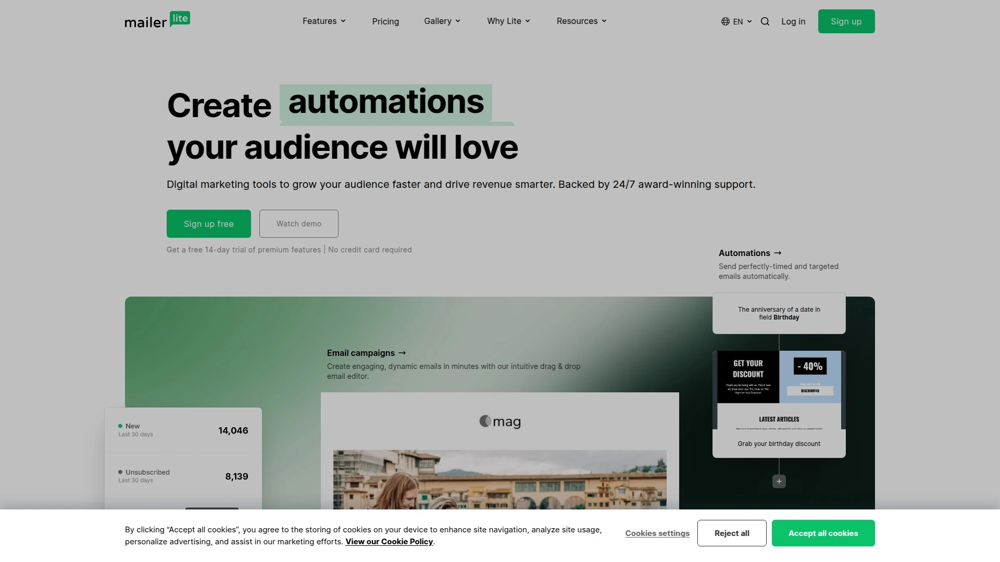

MailerLite targets cost-conscious users wanting essential email marketing without premium pricing. The platform balances affordability with usability exceptionally well.

Free plan accommodates 1,000 subscribers and 12,000 monthly emails with most features including automation, landing pages, and websites. This generosity makes MailerLite genuinely useful without immediate upgrades.

Drag-and-drop editor provides clean, user-friendly campaign creation with content blocks and customization. The straightforward design prevents overwhelming new users.

Automation capabilities enable creating visual workflows with conditional logic and behavior triggers. The automation builder rivals more expensive platforms functionally.

Landing page and website builder creates complete sites within MailerLite without requiring separate hosting. This consolidation simplifies web presence for small businesses.

Digital product selling allows creators to sell ebooks, courses, and downloads directly through MailerLite. The integrated commerce removes the need for additional platforms.

Email verification cleans lists by identifying invalid addresses before sending. This improves deliverability and reduces bounce rates.

Open rate tracking by location provides geographic insights into subscriber engagement. These analytics help tailor content to audience demographics.

Template selection offers responsive designs suitable for newsletters and campaigns. While smaller than some libraries, quality remains high.

Unsubscribe page customization maintains brand consistency even when people leave your list. This attention to detail extends throughout the platform.

Pricing starts at $10 monthly beyond the free tier, remaining among the most affordable options. The cost-effectiveness makes MailerLite ideal for bootstrapped businesses.

Customer support receives positive feedback for responsiveness despite lower pricing. The support quality exceeds expectations for budget tools.

Advanced features remain limited compared to enterprise platforms like ActiveCampaign. MailerLite excels at core email functions rather than extensive marketing suites.

***

## **[Brevo](https://brevo.com)**

Multi-channel marketing platform formerly known as Sendinblue, combining email, SMS, chat, and CRM with unlimited contact storage and pay-per-email pricing model.

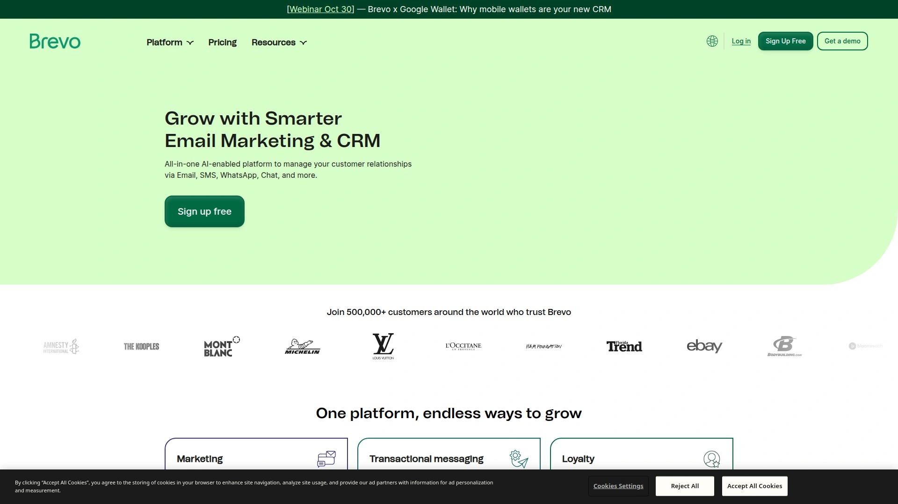

Brevo differentiates through unlimited contact storage regardless of plan, charging instead for emails sent. This structure benefits businesses with large lists sending infrequently.

Free plan provides 300 daily email sends with unlimited contacts, making it accessible for small businesses. The generous free tier includes SMS capabilities.

SMS marketing integrates with email for coordinated multi-channel campaigns. The combined messaging approach increases reach beyond email alone.

Live chat widget adds real-time website communication for customer support and sales. This positions Brevo as a customer communication hub.

CRM functionality tracks contacts, deals, and interactions within the platform. The integrated CRM suits small teams not needing dedicated software.

Email builder provides drag-and-drop design with content blocks and templates. The interface prioritizes ease of use.

Marketing automation creates workflows with triggers, conditions, and actions. The automation capabilities handle standard sequences effectively.

Transactional email sending handles order confirmations, password resets, and system notifications. The dual marketing and transactional capability simplifies infrastructure.

Segmentation uses contact attributes and behavior to target specific audiences. The filtering options enable basic personalization.

Landing page builder creates standalone pages for campaigns and lead capture. The pages integrate with email signups.

Pricing starts at $9 monthly for removing branding and increasing daily send limits. The pay-per-send model offers unique value for certain use cases.

Feature depth trails specialized email platforms, making Brevo better for multi-channel needs than pure email excellence. The platform prioritizes breadth over depth.

***

## **[Moosend](https://moosend.com)**

User-friendly email platform targeting small business ecommerce with AI-powered product recommendations, affordable pricing, and intuitive automation builder.

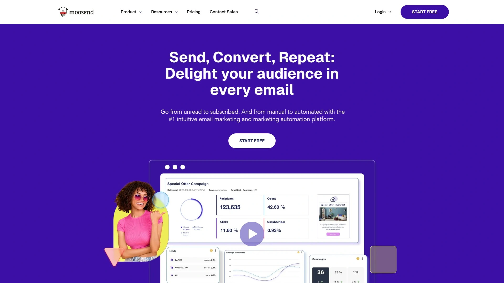

Moosend focuses on smaller digital stores wanting ecommerce features without complex enterprise platforms. The simplified approach suits email marketing newcomers.

Single pricing plan at $9 monthly for 500 contacts includes all features without tier restrictions. This straightforward pricing eliminates upsell complexity.

Product recommendation engine uses AI to suggest relevant items based on browsing and purchase behavior. These dynamic suggestions increase email revenue for stores.

Ecommerce tracking collects data on customer behavior in connected stores, powering behavioral automations. The tracking enables abandoned cart, browse abandonment, and product recommendation campaigns.

Automation builder creates workflows with conditional logic and yes/no branching based on subscriber actions. The visual editor makes complex sequences approachable.

Conditional content blocks personalize emails with different content for different subscribers within a single campaign. This dynamic content increases relevance without creating separate campaigns.

Template library provides responsive designs suitable for newsletters and promotions. The selection covers common business needs.

Drag-and-drop editor offers consistent, user-friendly campaign creation. The interface maintains simplicity across features.

List management and segmentation organize subscribers based on attributes and behavior. The segmentation capabilities handle standard targeting needs.

Landing page creator builds pages for lead capture and offers. The pages integrate with email automation.

Free trial lasts 30 days rather than offering a free-forever plan. The trial period allows testing before commitment.

Advanced features remain limited compared to enterprise platforms, with Moosend excelling at core ecommerce email rather than full marketing suites. The focused approach suits its target market.

***

## **[HubSpot](https://hubspot.com)**

Comprehensive inbound marketing platform combining email, CRM, social media, content management, and sales tools for businesses wanting unified customer data.

HubSpot operates as a complete business growth platform extending far beyond email marketing. The unified database connects all customer interactions across channels.

Free CRM provides robust contact management, deal tracking, and activity logging without cost limits. The CRM forms the foundation for all HubSpot tools.

Email marketing on the free plan allows 2,000 monthly sends with basic templates and tracking. This makes HubSpot accessible for testing before upgrading.

Marketing automation becomes available on paid plans with workflow builders creating lead nurturing sequences. The automation ties into CRM data for personalized experiences.

Landing page and form builders create conversion-optimized pages with A/B testing. The pages feed leads directly into the CRM.

Social media tools schedule posts, monitor mentions, and track engagement. The social integration consolidates channel management.

Content management system hosts blogs and websites within HubSpot. This positions HubSpot as an all-in-one business platform.

Analytics dashboard provides comprehensive reporting across email, web, and social channels. The unified reporting shows complete customer journeys.

Sales tools including meeting scheduling, email tracking, and pipeline management integrate with marketing activities. This alignment helps businesses close more deals.

Free plan generosity makes HubSpot worth considering despite limited email features. The CRM value alone justifies setup.

Pricing escalates quickly for advanced features with Professional plans starting at $800+ monthly. The comprehensive platform suits businesses ready for significant investment.

Complexity increases with the extensive feature set, requiring training to use effectively. Small businesses may find simpler alternatives more appropriate.

***

## **[Constant Contact](https://constantcontact.com)**

Beginner-friendly email service emphasizing ease of use, social media integration, and event marketing with 300+ templates and AI writing assistance.

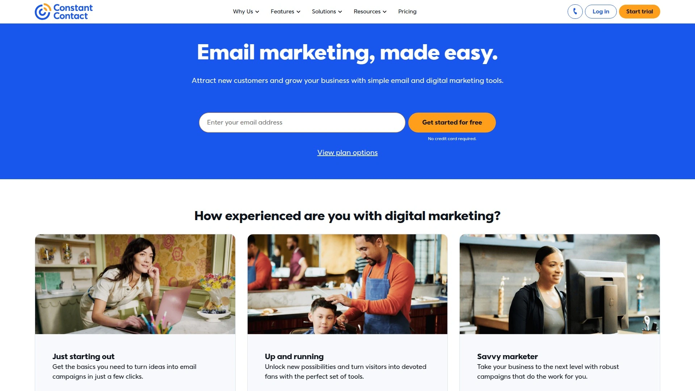

Constant Contact targets small businesses and nonprofits wanting straightforward email marketing without technical complexity. The platform has operated since the email marketing industry's early days.

Drag-and-drop editor provides intuitive campaign creation with AI writing assistant helping craft compelling copy. The guided interface works well for complete beginners.

Template library exceeds 300 responsive designs covering various industries and campaign types. The extensive selection accommodates most business needs.

Social media tools schedule posts, run ads, and track engagement from within Constant Contact. This consolidation simplifies multi-channel marketing.

Event marketing features create invitations, manage registrations, and track attendance for workshops, fundraisers, and gatherings. The event tools particularly suit nonprofits and local businesses.

Lead generation forms and popups capture email addresses from website visitors. The list-building tools help grow subscriber bases.

Basic automation handles welcome emails and birthday messages but lacks sophisticated workflow capabilities. The automation works for simple sequences.

Mobile app enables creating and sending campaigns from smartphones. The mobile functionality helps small business owners without constant desktop access.

Customer support includes phone, chat, and email assistance. The accessible support helps newcomers navigate email marketing.

Pricing starts at $12 monthly for 500 contacts with a 60-day free trial. The trial period exceeds most competitors.

Advanced automation limitations mean businesses needing sophisticated workflows outgrow Constant Contact. The platform excels at simplicity rather than complexity.

***

## **[Drip](https://drip.com)**

Ecommerce marketing automation platform focusing on B2C personalization with visual workflows, behavioral triggers, and multi-channel campaigns for online stores.

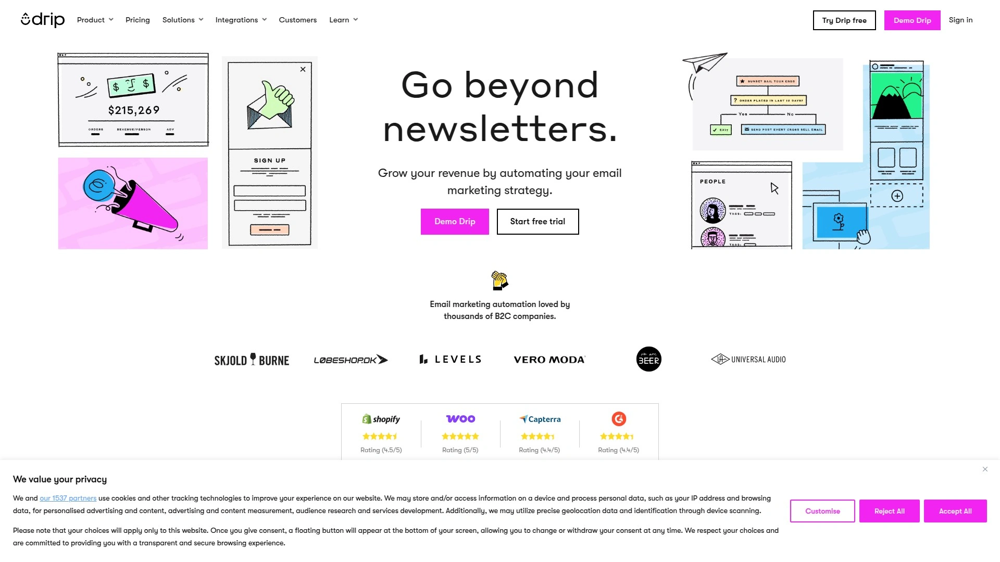

Drip positions itself as the only CRM built specifically for B2C ecommerce businesses. The platform assumes product catalogs, purchase data, and shopping behavior.

Visual automation builder creates workflows with conditional branching based on behavior, purchases, and engagement. The sophisticated automation rivals enterprise platforms.

Ecommerce integrations connect Shopify, WooCommerce, and other platforms for real-time data sync. The deep integrations power personalized campaigns.

Multi-channel campaigns coordinate email, SMS, and on-site personalization from unified workflows. The channel orchestration improves customer experience.

Revenue attribution tracks sales generated by campaigns and automations. This financial reporting helps justify marketing investment.

Segmentation sophistication uses purchase history, browsing behavior, and predicted lifetime value to create precise audiences. The ecommerce-focused filters understand shopping patterns.

Pre-built automation recipes deploy abandoned cart, welcome series, and post-purchase sequences quickly. The templates optimize for ecommerce conversion.

Form builder creates popups and embedded signup forms with targeting rules. The lead capture tools focus on store conversion.

Email editor provides drag-and-drop design with product blocks and dynamic content. The straightforward interface prevents overwhelming store owners.

Pricing starts at $39 monthly for 2,500 contacts including full feature access. The cost reflects the platform's sophistication.

Learning curve exists due to feature depth, though the interface remains cleaner than some enterprise alternatives. Investment in learning pays off with powerful capabilities.

Limited appeal outside ecommerce means non-retail businesses find better-suited alternatives. Drip's design assumes online stores.

***

## **[Campaigner](https://campaigner.com)**

Advanced email and SMS platform with sophisticated automation, 900+ templates, and reputation management tools for high-volume senders.

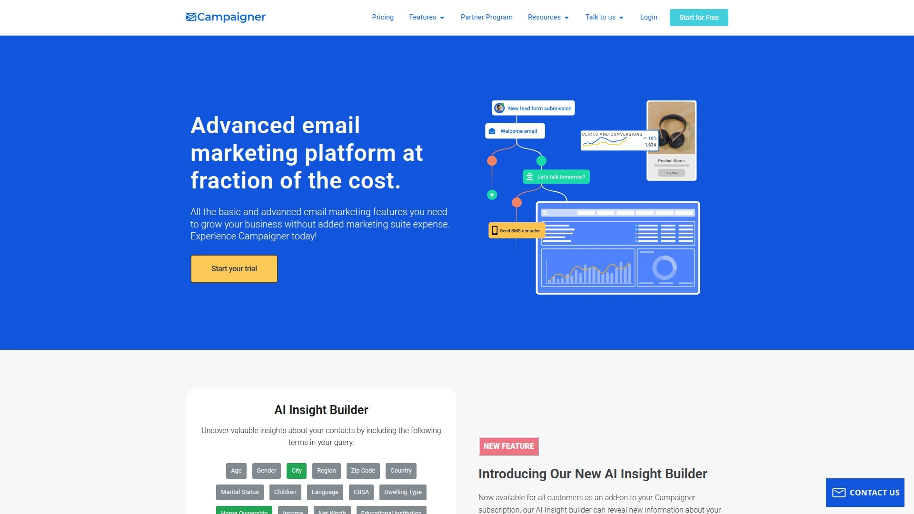

Campaigner targets established businesses sending large email volumes needing advanced features. The platform handles complex requirements effectively.

Automation capabilities create both simple and complex workflows using a visual builder. The workflows combine email and SMS into unified sequences.

Template library provides 900+ responsive designs optimized for various email clients. The extensive selection covers virtually any campaign type.

Reusable content blocks function as mini-templates dropped into emails for consistency. These blocks work well with dynamic content for personalization.

Dynamic content personalizes messages with different text, images, and offers for different subscribers. The advanced personalization increases relevance.

Reputation Defender maintains list hygiene by filtering invalid and risky email addresses. This deliverability protection helps maintain sender reputation.

Geolocation, purchase behavior, and advanced segmentation create highly targeted audiences. The sophisticated targeting exceeds simpler platforms.

Ecommerce integrations enable conversion tracking and abandoned cart recovery. The commerce features suit online retailers.

API access allows bulk sending for transactional emails and custom integrations. The technical flexibility accommodates developer needs.

High deliverability at bulk volumes reflects Campaigner's infrastructure for large senders. The platform maintains performance at scale.

Pricing starts at $59 monthly for 5,000 contacts and 30,000 emails. The cost positions Campaigner at the premium end.

Complex features can overwhelm beginners with the interface assuming email marketing experience. The power comes with complexity.

Customer support response times receive mixed feedback. Support quality varies based on plan level.

***

## **[Omnisend](https://omnisend.com)**

Ecommerce marketing automation platform combining email, SMS, push notifications, and retargeting for online stores maximizing customer engagement.

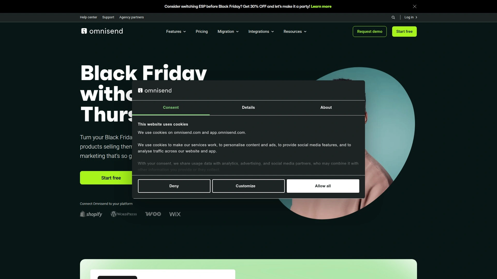

Omnisend specializes exclusively in ecommerce with pre-built workflows for store-specific scenarios. The platform design assumes product catalogs and transactions.

Multi-channel workflows coordinate email, SMS, web push notifications, and retargeting ads from unified automation. The channel orchestration improves customer reach.

Shopify integration depth provides 4.8-star rating with seamless product sync and purchase tracking. The tight integration makes setup straightforward for store owners.

Pre-designed workflows for welcome series, abandoned carts, browse abandonment, and order follow-ups deploy in minutes. These ecommerce-optimized automations convert effectively immediately.

Product picker adds items directly into emails with images, prices, and buy buttons. The dynamic product blocks simplify promotional campaigns.

Popup and form builder creates signup forms with targeting rules based on behavior. The list-building tools capture more subscribers effectively.

Revenue reporting shows sales generated by specific campaigns and automations. The financial attribution helps optimize marketing spend.

Segmentation uses purchase history, browsing behavior, and engagement to create targeted audiences. The ecommerce-focused filters understand shopping patterns.

Email builder provides drag-and-drop design with product blocks and templates. The interface prioritizes ease of use for non-designers.

Free plan accommodates 250 contacts with 500 monthly emails, making Omnisend testable. Paid plans start at reasonable rates for growing stores.

Customer support receives high marks with award-winning 24/7 assistance. The responsive support helps store owners maximize results.

Limited appeal outside ecommerce means service businesses find better alternatives. Omnisend's features assume online retail.

***

## **[Flodesk](https://flodesk.com)**

Design-first email platform emphasizing visual aesthetics with flat-rate pricing, unlimited subscribers, and templates focused on creative professionals and lifestyle brands.

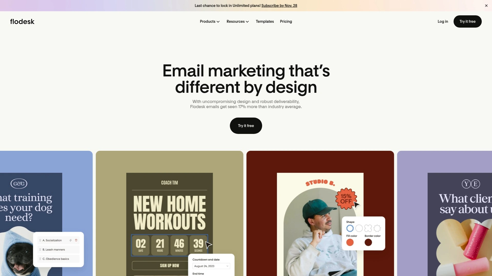

Flodesk targets creators, designers, and brands prioritizing visual beauty in email communications. The platform appeals to visually-oriented entrepreneurs.

Template aesthetic stands out with modern, Instagram-worthy designs emphasizing whitespace and imagery. The templates feel premium compared to traditional email layouts.

Flat-rate pricing charges $38 monthly regardless of subscriber count. This unlimited structure benefits creators with large lists.

Email builder uses intuitive drag-and-drop with design constraints maintaining visual quality. The guided approach prevents creating ugly emails.

Form and checkout pages create branded lead capture and payment experiences. The visual consistency extends beyond email.

Automation capabilities remain basic with simple workflows compared to advanced platforms. Flodesk prioritizes design over sophisticated logic.

Segmentation options enable basic subscriber targeting without complex filtering. The simplified approach suits straightforward campaigns.

Mobile optimization ensures emails look beautiful on smartphones automatically. The responsive design maintains quality across devices.

Limited advanced features mean businesses needing complex automation outgrow Flodesk. The platform excels at visual communication rather than marketing sophistication.

Integration options remain more limited than established platforms. The newer platform connects fewer third-party tools.

Target audience leans heavily toward female entrepreneurs in creative and lifestyle industries. The aesthetic may not suit all business types.

***

## **[Beehiiv](https://beehiiv.com)**

Newsletter-first platform built for publishers, writers, and content creators monetizing through subscriptions, with growth tools, recommendations network, and built-in analytics.

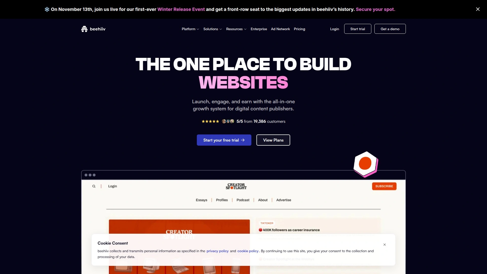

Beehiiv emerged as a modern newsletter platform competing directly with Substack. The platform focuses exclusively on newsletter publishing and growth.

Monetization features enable paid subscriptions, sponsored content, and ad networks within the platform. These multiple revenue streams help creators earn from audiences.

Referral program encourages subscribers to share newsletters with rewards for successful recommendations. This built-in growth mechanism helps expand reach organically.

Boost feature allows paying other newsletters to recommend yours or getting paid to recommend others. The creator-to-creator network accelerates growth.

Segmentation capabilities target specific subscriber groups based on behavior and attributes. The advanced filtering exceeds simpler newsletter tools.

Automated sequences create welcome series and nurture campaigns. The automation capabilities surpass Substack significantly.

Analytics dashboard provides detailed metrics on growth, engagement, and revenue. The comprehensive reporting helps optimize newsletter strategy.

Poll and survey features engage subscribers directly within emails. The interactive elements boost participation.

Website builder creates a publication home with archive and subscription pages. The integrated site eliminates needing separate platforms.

Free plan supports unlimited subscribers with 2,500 monthly emails. The generous starter tier enables launching without cost.

Comment and like features recently added but remain less developed than Substack's community tools. The engagement features continue evolving.

Pricing starts at $49 monthly for the Grow plan with advanced features. The cost reflects serious publisher needs.

***

## **[Substack](https://substack.com)**

Newsletter platform and writer community emphasizing simplicity, community building, and monetization through paid subscriptions with integrated discussion features.

Substack pioneered the modern newsletter renaissance by making publication and monetization dead simple for writers. The platform attracts journalists, authors, and thought leaders.

Free to use with Substack taking 10% of subscription revenue only when writers charge. This aligns Substack's incentives with creator success.

Community features including comments, likes, discussions, and Notes create engagement beyond email. The social elements help build loyal audiences.

Paid subscription handling manages billing, subscriber access, and payment processing automatically. Writers focus on content while Substack handles commerce.

Discovery network surfaces newsletters to potential subscribers browsing Substack. The recommendation system helps new writers find audiences.

Direct messaging enables private communication between writers and subscribers. The personal connection deepens relationships.

Mobile app provides readers a dedicated inbox for Substack newsletters. The app experience differentiates from regular email.

Simple text editor prioritizes writing over visual design. The minimalist approach keeps focus on content quality.

Limited customization and branding options reflect Substack's opinionated design. Writers wanting extensive customization need alternatives.

No advanced automation or segmentation suits straightforward newsletter publishing but limits marketing sophistication. Substack optimizes for simplicity over complexity.

Platform dependency means writers don't own subscriber relationships directly. The trade-off for simplicity includes reduced control.

Social media evolution with Notes and other features divides the community between original newsletter focus and new directions. The platform identity continues shifting.

***

## **[Campaign Monitor](https://campaignmonitor.com)**

Professional email platform serving agencies and businesses with client management tools, drag-and-drop builder, and journey designer for automated campaigns.

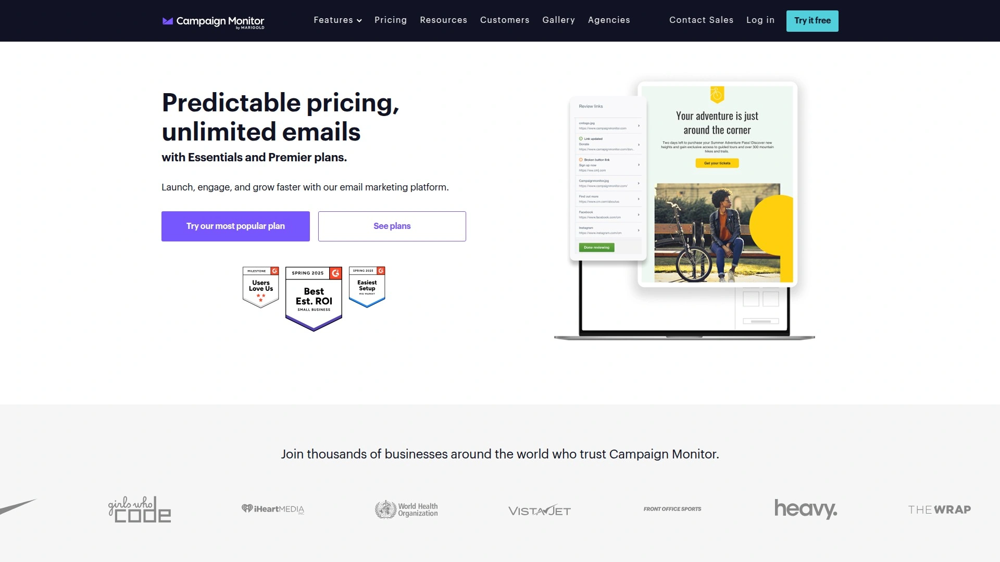

Campaign Monitor targets marketing agencies and businesses wanting professional-grade email tools. The platform enables managing multiple client accounts.

Client management features allow agencies to maintain separate accounts, billing, and templates for each client. This agency-friendly structure simplifies operations.

Email builder provides drag-and-drop design with customization flexibility. The editor balances ease of use with creative control.

Journey designer creates visual customer journeys with triggers and conditions. The automation builder handles multi-step sequences.

Template library offers professionally designed responsive templates. The quality suits client-facing work.

Transactional email sending handles order confirmations and system notifications alongside marketing. The dual capability consolidates infrastructure.

Segmentation enables targeting specific audiences based on attributes and behavior. The filtering options support personalized campaigns.

Analytics reporting provides detailed metrics on campaign performance. The reports help demonstrate value to clients or stakeholders.

Integration options connect various business tools and platforms. The compatibility ensures workflow continuity.

Pricing reflects professional positioning at higher tiers than budget alternatives. The cost suits agencies billing clients rather than bootstrapped solopreneurs.

Limited free plan means testing requires commitment. The trial period allows evaluation before purchasing.

***

## **[EmailOctopus](https://emailoctopus.com)**

Ultra-affordable email platform built on Amazon SES with generous free plan, basic automation, and simple interface for budget-conscious senders.

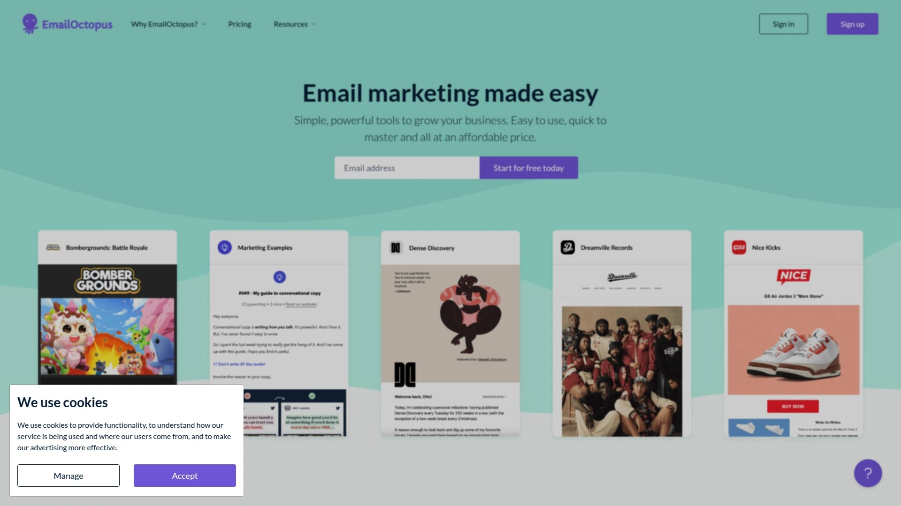

EmailOctopus differentiates through exceptional value with the lowest paid plan pricing found. The affordability makes email marketing accessible to bootstrapped businesses.

Free plan provides 2,500 subscribers and 10,000 monthly sends including most features. The generous allowance enables meaningful usage without payment.

Paid plans start at just $8 monthly for 5,000 subscribers. Scaling to 10,000 subscribers costs only $40 monthly.

Amazon SES infrastructure powers delivery, providing reliable sending at low cost. The proven backbone ensures deliverability.

Email editor offers drag-and-drop design though somewhat less polished than premium alternatives. The functional builder handles standard campaigns.

Automation includes up to three workflows on the free plan with basic triggers. The automation capabilities handle simple sequences.

Template selection provides dozens of responsive designs covering common needs. The library suffices for straightforward campaigns.

Segmentation enables audience targeting based on standard dimensions and some engagement metrics. The filtering handles basic personalization.

Landing page builder creates simple pages for lead capture. The pages integrate with email signups.

Limited advanced features reflect the budget positioning. EmailOctopus excels at affordable core email rather than sophisticated marketing.

Interface simplicity appeals to users wanting straightforward tools without complexity. The uncomplicated design prevents overwhelm.

***

## **[Benchmark Email](https://benchmarkemail.com)**

User-friendly email platform with multilingual support, responsive templates, and straightforward editor designed for small businesses globally.

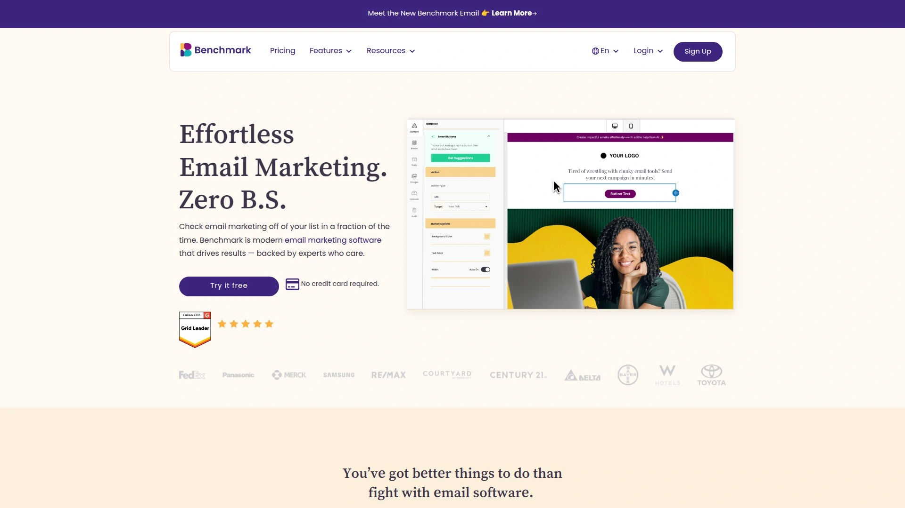

Benchmark Email serves small businesses across international markets with support for multiple languages. The global focus suits diverse user bases.

Drag-and-drop editor provides intuitive campaign creation without technical skills. The user-friendly interface suits beginners.

Template library offers responsive designs optimized for mobile devices. The selection covers various campaign types.

Automation capabilities create triggered sequences based on subscriber behavior. The workflow builder handles standard automations.

List management organizes subscribers with segmentation based on attributes. The targeting enables basic personalization.

A/B testing compares subject lines and content to optimize performance. The split testing helps improve results.

Landing page creator builds standalone pages for campaigns and lead capture. The pages integrate with email lists.

Multilingual customer support assists users in their native languages. The international support accessibility differentiates Benchmark.

Free plan provides 500 subscribers with 3,500 monthly emails. The free tier enables testing before upgrading.

Pricing starts at $15 monthly for expanded features and sending limits. The competitive rates suit small business budgets.

Advanced capabilities remain limited compared to sophisticated platforms. Benchmark excels at simple, reliable email sending.

Integration options connect standard business tools though the library size trails larger competitors. The essential integrations exist.

***

## **[SendPulse](https://sendpulse.com)**

Multi-channel platform combining email, SMS, web push, and chatbots with affordable pricing and AI-powered features for growing businesses.

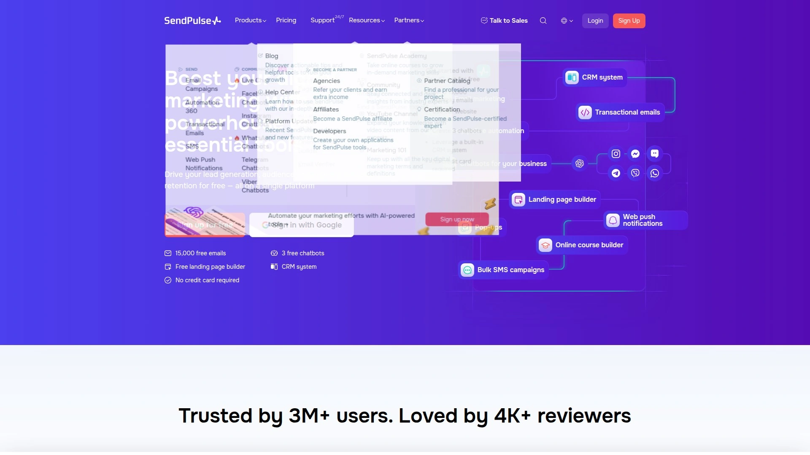

SendPulse differentiates through multi-channel marketing beyond email alone. The consolidated platform manages diverse communication channels.

Email builder provides drag-and-drop design with interactive AMP email support. The AMP capability enables dynamic content and actions within emails.

Automation workflows create sequences with basic triggers, conditions, and actions including webhooks. The flexible automation handles standard scenarios.

SMS marketing integrates with email for coordinated campaigns. The combined messaging improves customer reach.

Web push notifications reach subscribers even without email opens. The additional channel increases engagement opportunities.

Chatbot builder creates automated conversations for websites and messaging apps. The bot functionality handles common inquiries automatically.

AI-powered segmentation and personalization optimize message relevance automatically. The intelligent features improve campaign performance.

Free plan provides 500 subscribers and 15,000 monthly emails. The generous allowance enables testing multi-channel capabilities.

Pricing remains highly competitive with cost-effective scaling. The value proposition suits budget-conscious businesses.

Transactional email handling covers order confirmations and system notifications. The dual marketing and transactional capability simplifies infrastructure.

Integration library connects 65 third-party applications. The selection covers essential tools though trails larger platforms.

Learning curve exists due to the breadth of features across multiple channels. The comprehensive platform requires time to master.

***

## **[Mailjet](https://mailjet.com)**

Developer-friendly email platform emphasizing real-time collaboration, SMTP relay, and transactional email alongside marketing campaigns for technical teams.

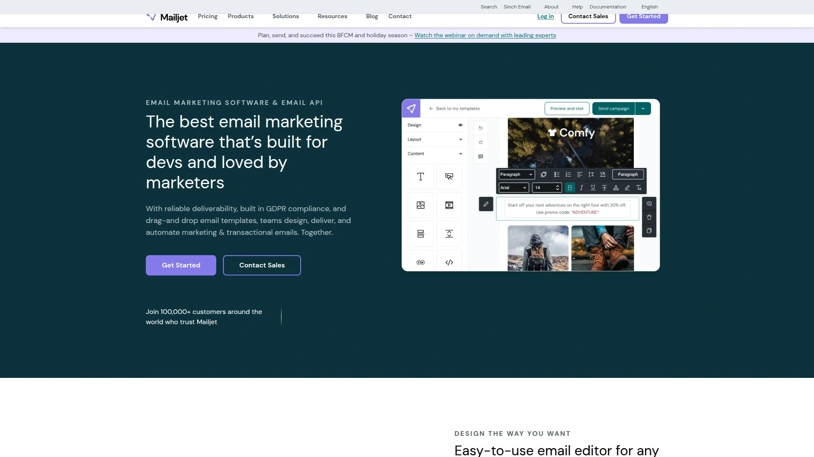

Mailjet targets technical users and development teams needing both marketing and transactional email. The platform balances developer needs with marketer accessibility.

Real-time collaboration enables teams to work on email drafts simultaneously. The co-editing functionality streamlines teamwork.

SMTP relay service integrates with applications for sending transactional emails. The reliable infrastructure handles system notifications.

Email automation sets up workflows to send targeted messages based on behavior. The automation capabilities cover standard sequences.

Drag-and-drop builder creates visually appealing emails without coding. The editor accommodates non-technical marketers.

HTML code blocks enable developers to insert custom-coded sections. The technical flexibility suits teams with coding resources.

API documentation provides comprehensive guides for integration. The developer resources support custom implementations.

Template library offers pre-designed responsive layouts. The selection covers common campaign types.

Free plan provides 200 daily emails with unlimited contacts. The contact-unlimited structure benefits businesses with large inactive lists.

Pricing starts affordably for small sending volumes. The pay-as-you-grow model scales with usage.

Integration options connect 120 third-party applications. The library covers essential business tools.

Marketing features trail pure marketing platforms like Mailchimp. Mailjet optimizes for technical flexibility over marketing sophistication.

***

## **[Keap](https://keap.com)**

All-in-one CRM and marketing automation platform formerly known as Infusionsoft, combining email, sales pipeline, and invoicing for small business growth.

Keap serves small businesses needing combined CRM, marketing automation, and payment processing. The all-in-one approach consolidates multiple business functions.

CRM functionality tracks contacts, deals, and activities throughout the sales process. The integrated database connects marketing and sales seamlessly.

Marketing automation creates sophisticated workflows with triggers, conditions, and tags. The visual builder handles complex customer journeys.

Email campaigns integrate with CRM data for personalized messaging based on contact attributes and behavior. The tight integration enables advanced targeting.

Payment processing and invoicing handle transactions directly within Keap. The financial tools simplify getting paid.

Appointment scheduling coordinates meetings and calls automatically. The calendar integration streamlines client coordination.

Landing pages and forms capture leads feeding directly into the CRM. The lead generation tools integrate with nurture sequences.

Pipeline management visualizes deals moving through sales stages. The sales focus differentiates Keap from pure marketing platforms.

Reporting provides analytics on marketing campaigns, sales performance, and revenue. The comprehensive insights span the full customer lifecycle.

Integration options extend functionality though some users route transactional emails through services like SendGrid for better deliverability. The workarounds address platform limitations.

Pricing starts higher than pure email platforms reflecting the comprehensive feature set. The investment suits businesses needing CRM beyond email.

Complexity increases with the extensive features requiring training to use effectively. The power comes with a learning investment.

Email deliverability concerns lead some users to route certain messages through external services. The marketing email policies affect transactional sending.

***

## What's the difference between newsletter platforms and email marketing services?

Newsletter platforms like Beehiiv and Substack prioritize content publishing with clean reading experiences, built-in monetization through subscriptions, and community features like comments. These tools optimize for writers sending regular content to engaged audiences who want to read long-form articles. Email marketing services like ActiveCampaign and Mailchimp focus on campaign automation, ecommerce integration, and behavioral triggers for businesses nurturing leads through sales funnels.

The choice depends on your primary goal: newsletter platforms suit content creators building audiences around ideas, while marketing services work better for businesses selling products through automated sequences. Many creators eventually use both, publishing newsletters through dedicated platforms while maintaining separate marketing automation for course sales and product launches.

## How do email marketing platforms calculate pricing and what should I watch for?

Most platforms charge based on subscriber count, with per-contact pricing increasing as your list grows. Others like Brevo charge per email sent rather than contacts stored, benefiting businesses with large inactive lists. Flodesk stands out with flat-rate unlimited subscriber pricing at $38 monthly regardless of list size.

Watch for hidden costs including charges for removing platform branding, accessing automation features, or using advanced segmentation that should be standard. Free plans often restrict critical features like automation or limit sending volumes severely, forcing upgrades before you're ready. Annual billing typically saves 15-30% compared to monthly payments, though it requires upfront commitment.

## Which email platforms work best for creators selling courses and digital products?

Kit leads for creators with integrated commerce allowing direct sales of ebooks, courses, and subscriptions without external platforms. The creator-specific design includes recommendation networks, sponsor connections, and email sequences optimized for digital product launches. Kajabi provides course hosting plus email marketing in one platform, eliminating integration needs for educators.

For ecommerce stores selling physical products, Klaviyo and Omnisend specialize in product-based automation with abandoned cart recovery, browse abandonment, and dynamic product recommendations. These platforms assume inventory management and transactional data, making them overkill for pure digital creators. Service businesses and coaches typically thrive with ActiveCampaign's sophisticated automation and CRM integration for nurturing consulting leads.

***

Choosing the right email marketing platform fundamentally shapes how effectively you grow and monetize your audience, whether you're launching newsletters, selling courses, or running an ecommerce store requiring sophisticated automation. **[Kit](https://convertkit.com)** stands out for creators prioritizing audience building through its visual automation workflows, integrated digital product selling, and creator-specific features like the recommendations network that helps you grow through cross-promotion. The generous free plan supporting 10,000 subscribers with unlimited sends makes Kit genuinely usable before requiring payment, while the tag-based management and landing page tools provide everything needed to build, nurture, and monetize an email list from a single platform.
